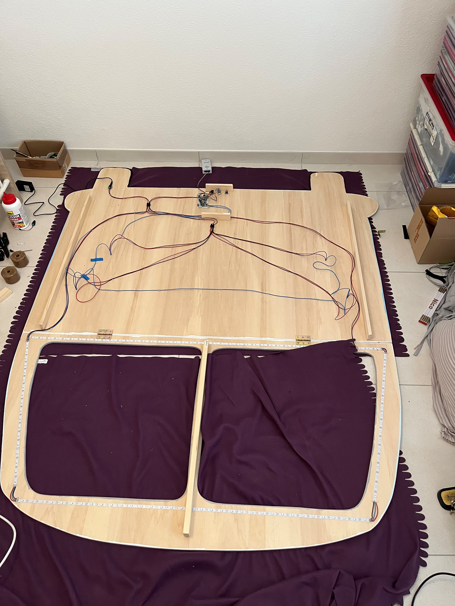
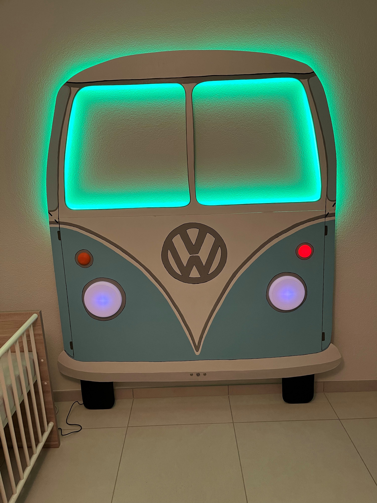

# STM32F1XX_Bulli

A small Project for a diy VW Bulli out of wood. The VW Bulli has been extended with a Blue Pill Board (STM32F103), WS2812b RGB led stripes and buttons.

Many thanks to Linda for this nice wood and paint work of the VW Bulli.

## Pictures

